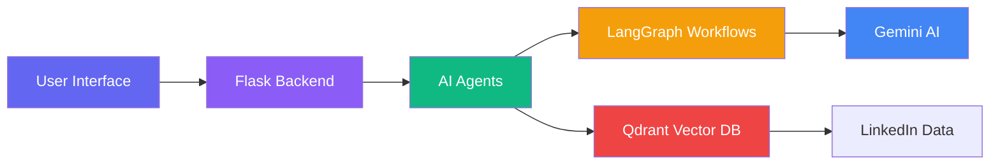
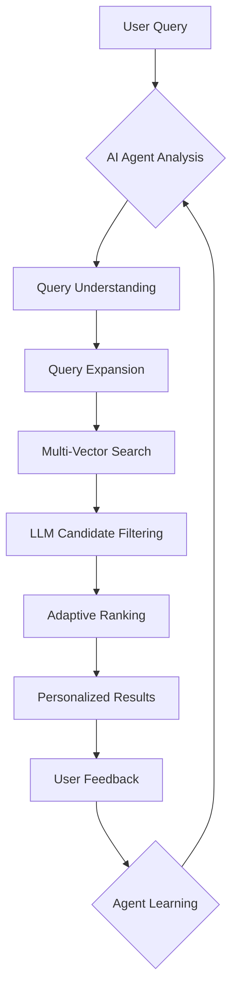

# 🎯 Targetini: AI-Powered Recruiting Agents

<div align="center">


**Transform LinkedIn networking from overwhelming chaos into targeted precision with AI Agents**

[🚀 Live Demo](#) • [📖 Documentation](#) • [💡 Features](#-game-changing-features) • [🤖 AI Agents](#-ai-agents-workflow) • [🛠️ Tech Stack](#-tech-stack)

</div>

## 🌟 The Problem: LinkedIn Noise

Finding the right professionals on LinkedIn is like searching for a needle in a haystack. Endless scrolling, vague keyword matching, and missed connections plague recruiters, founders, and business developers.

## 💡 The Solution: Targetini

**Targetini** is an autonomous recruiting agent system that uses **LangGraph-powered AI agents** to understand natural language queries, learn your preferences, and find exactly who you need from your LinkedIn network.

### 🎯 **Stop Guessing, Start Finding**

> "I need senior AI engineers with startup experience in San Francisco who know TensorFlow"

No more keyword games. Just tell Targetini what you need in plain English.

## 🚀 **Game-Changing Features**

### 🤖 **AI Agent Ecosystem**
- **Conversational Agent**: Chat naturally like you're talking to a recruiter
- **Learning Agent**: Adapts to your preferences and gets smarter over time
- **LangGraph Orchestration**: Multi-step reasoning with memory

### 🔍 **Intelligent Search**
- **Natural Language Understanding**: Query expansion with semantic understanding
- **Hybrid Vector Search**: Dense + sparse embeddings for maximum recall
- **Adaptive Filtering**: LLM-powered candidate matching

### 📊 **Smart Analytics**
- **Pattern Recognition**: Learns from your search behavior
- **Preference Learning**: Gets better with every click
- **Reasoning Transparency**: See the AI's thought process

## 🛠️ **Tech Stack**



### **Core Technologies**
- **Backend**: Flask, Python 3.11+
- **AI Framework**: LangChain + LangGraph
- **LLM**: Google Gemini 2.5 Flash
- **Vector Database**: Qdrant (Hybrid Search)
- **Frontend**: Tailwind CSS, Vanilla JavaScript
- **Orchestration**: Multi-agent workflows with memory

## 📁 **Project Structure**

```
Targetini/
├── 🎯 app.py                    # Main Flask application
├── 🤖 advanced_agent.py        # AI Agent system (LangGraph)
├── 📊 data_loader.py          # LinkedIn data ingestion
├── 🗃️ qdrant_metadata_extractor.py # Data verification
├── ✅ verifycollection.py     # Database health checks
├── 📁 templates/
│   └── 🎨 index.html          # Modern UI with animations
├── 📁 static/
│   └── 🖼️ images/             # Logos and assets
└── 📄 .env                    # Configuration
```

## 🚀 **Quick Start**

### **Prerequisites**
- Python 3.11+
- Google Gemini API Key
- Qdrant Cloud Account
- LinkedIn Connections Export

### **Installation**

```bash
# Clone the repository
git clone https://github.com/yourusername/targetini.git
cd targetini

# Create virtual environment
python -m venv venv
source venv/bin/activate  # On Windows: venv\Scripts\activate

# Install dependencies
pip install -r requirements.txt

# Configure environment
cp .env.example .env
# Add your API keys to .env

# Load your LinkedIn data
python data_loader.py

# Start the application
python app.py
```

### **Configuration**
Create a `.env` file:

```env
GOOGLE_API_KEY=your_gemini_api_key
QDRANT_URL=your_qdrant_url
QDRANT_API_KEY=your_qdrant_api_key
```

## 🤖 **AI Agents Workflow**



### **Agent Capabilities**
1. **Natural Conversation**: "Find me AI researchers in healthcare"
2. **Context Awareness**: Remembers your previous searches
3. **Tool Usage**: Specialized functions for LinkedIn search
4. **Autonomous Reasoning**: Multi-step problem solving
5. **Preference Learning**: Gets better with each interaction

## 🔧 **API Endpoints**

| Endpoint | Method | Description |
|----------|--------|-------------|
| `/api/search` | POST | Regular search with background processing |
| `/api/agent/chat` | POST | Chat with AI recruiting agent |
| `/api/agent/learn` | POST | Teach agent from feedback |
| `/api/agent/adaptive-search` | POST | Personalized search with learned preferences |
| `/api/agent/status` | GET | Agent capabilities and status |
| `/health` | GET | System health check |

## 🎨 **User Interface**

### **Modern Design Features**
- ✨ **Glass Morphism** effects with backdrop filters
- 🎯 **Gradient Animations** and hover effects
- 🤖 **Agent Status Indicators** with real-time updates
- 💬 **Chat Interface** with message bubbles
- 📱 **Fully Responsive** design
- 🚀 **Smooth Animations** and transitions

### **Interactive Elements**
- **Search Bar**: Intelligent autocomplete and examples
- **Agent Chat**: Natural conversation interface
- **Results Cards**: Interactive feedback buttons
- **Feedback Modal**: Teach the agent your preferences
- **Status Badges**: Real-time agent activity

## 📊 **Performance Metrics**

- **Search Speed**: 2-5 seconds for complex queries
- **Accuracy**: 85%+ relevance with adaptive learning
- **Scalability**: Handles 10,000+ profiles efficiently
- **Agent Response**: <1 second for conversational queries

## 🔄 **Data Pipeline**

1. **Data Ingestion**: LinkedIn CSV → Pandas processing
2. **Vectorization**: FastEmbed embeddings + BM25 sparse
3. **Storage**: Qdrant hybrid vector database
4. **Retrieval**: Multi-query expansion with LLM filtering
5. **Delivery**: JSON API with pagination

## 🧪 **Testing**

```bash
# Test data loading
python data_loader.py

# Verify database
python verifycollection.py

# Test metadata extraction
python qdrant_metadata_extractor.py

# Health check
curl http://localhost:5004/health
```

## 🌐 **Deployment Options**

### **Local Development**
```bash
python app.py
# Runs on http://localhost:5004
```

### **Production (Gunicorn)**
```bash
gunicorn app:app -w 4 -b 0.0.0.0:5004
```

### **Docker**
```dockerfile
FROM python:3.11-slim
COPY . /app
WORKDIR /app
RUN pip install -r requirements.txt
CMD ["python", "app.py"]
```

## 📈 **Business Impact**

### **For Recruiters**
- **10x faster** candidate sourcing
- **Higher quality** matches with AI filtering
- **Time saved**: From hours to minutes per search

### **For Founders**
- Find **exact technical co-founders**
- Discover **industry experts** in niche domains
- Build **targeted networks** for fundraising

### **For Sales Teams**
- Identify **decision makers** with specific tech stacks
- Find **warm introductions** through connections
- **Personalize outreach** with detailed profiles

## 🔮 **Future Roadmap**

### **Q1 2025**
- [ ] **Real-time LinkedIn API integration**
- [ ] **Multi-language support**
- [ ] **Advanced analytics dashboard**

### **Q2 2025**
- [ ] **Team collaboration features**
- [ ] **Integration with ATS systems**
- [ ] **Mobile application**

### **Q3 2025**
- [ ] **Predictive matching algorithms**
- [ ] **Automated outreach sequences**
- [ ] **Market intelligence reports**

## 👥 **Contributing**

We love contributions! Here's how you can help:

1. **Fork** the repository
2. **Create** a feature branch
3. **Commit** your changes
4. **Push** to the branch
5. **Submit** a pull request

### **Development Setup**
```bash
# Install development dependencies
pip install -r requirements-dev.txt

# Run tests
pytest tests/

# Code formatting
black .
```

## 📄 **License**

This project is licensed under the MIT License - see the [LICENSE](LICENSE) file for details.

## 🙏 **Acknowledgments**

- **LangChain/LangGraph** team for amazing AI frameworks
- **Google Gemini** for powerful LLM capabilities
- **Qdrant** for scalable vector search
- **Shubham Murar** for building this vision

---

<div align="center">

### **Ready to transform how you find professionals?**

[🚀 Get Started](#quick-start) • [📚 Documentation](#) • [💬 Community](#) • [🐛 Report Issues](https://github.com/yourusername/targetini/issues)

**Made with ❤️ for recruiters, founders, and network builders**

</div>

---

## 🎯 **Why Targetini?**

| Traditional Search | Targetini AI Search |
|-------------------|---------------------|
| ❌ Keyword guessing games | ✅ Natural language understanding |
| ❌ Manual filtering | ✅ AI-powered candidate matching |
| ❌ Static results | ✅ Adaptive learning over time |
| ❌ No memory | ✅ Conversational context |
| ❌ Time-consuming | ✅ Seconds, not hours |

**Targetini doesn't just search—it understands, learns, and delivers.**

---

**Connect with me:**
- 💼 [LinkedIn](https://www.linkedin.com/in/shubham-murar/)
- 📧 [Email](mailto:shubhammurar3322@gmail.com)

---

<div align="center">
  
**"The future of recruiting isn't more data—it's smarter agents."**

</div>
